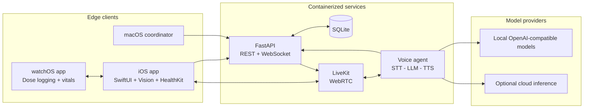

# DoseLuma

[](https://github.com/evanc-hane/dose-luma/actions/workflows/ci.yml)
[](https://www.python.org/)
[](https://www.swift.org/)
[](LICENSE)

DoseLuma is a safety-oriented, multimodal medication-assistance platform for home care. It combines an iOS and Apple Watch experience with a Python inference backend and a real-time voice agent to support medication reminders, adherence logging, label recognition, and caregiver escalation.

The project focuses on the engineering work around applied ML: constructing an evaluation set, designing deterministic fallbacks, instrumenting latency, serving model-backed decisions through APIs, and handling failures in a privacy-sensitive workflow.

> Portfolio prototype only. DoseLuma is not a medical device and does not recommend medication or dosage.

## ML and systems highlights

| Area | Implementation |
| --- | --- |
| Hybrid intent inference | Configurable OpenAI-compatible LLM classifier with a deterministic lexical fallback for `Taken`, `Refused`, `Delayed`, `Confused`, and `Distress` |
| Reproducible evaluation | 100 labelled synthetic dialogues, per-class precision/recall/F1, confusion matrix, latency measurement, and CI quality gates |
| On-device vision | Apple Vision/VisionKit OCR, barcode extraction, and pill morphology heuristics; medication images stay on the device |
| Real-time AI | LiveKit WebRTC pipeline for STT, LLM reasoning, TTS, silence detection, and proactive medication check-ins |
| Production safeguards | Persisted dispatch cooldowns, duplicate-dose detection, graceful model fallback, caregiver escalation, and health endpoints |
| Deployment | FastAPI, SQLite, provider-agnostic model configuration, Docker Compose, locked Python dependencies, and GitHub Actions |

## Architecture



The backend owns schedules, adherence state, token issuance, alerts, and synchronization. Vision inference runs on-device; model providers and credentials remain behind the service boundary. See [Architecture](docs/ARCHITECTURE.md) for component and failure-mode details.

## Evaluation snapshot

The deterministic fallback is measured on a versioned set of 100 synthetic medication-adherence utterances:

| Metric | Result |
| --- | ---: |
| Accuracy | **99%** (99/100) |
| Distress recall | **100%** (20/20) |
| Taken F1 | 1.000 |
| Refused F1 | 1.000 |
| Delayed F1 | 0.974 |
| Confused F1 | 0.976 |
| Distress F1 | 1.000 |

These numbers are regression results, not clinical-performance claims. The fixture is synthetic and intentionally narrow; realistic speech, accents, transcription errors, calibration, and out-of-distribution detection remain future evaluation work. See [Evaluation](docs/EVALUATION.md).

## Repository layout

```text
.
|-- app/
|   |-- agent/                  # LiveKit voice-agent worker
|   |-- backend/                # FastAPI service, evaluation, and tests
|   `-- doseluma_swift/         # iOS, watchOS, and macOS Xcode project
|-- docker/                     # Optional local speech-service image
|-- docs/                       # Architecture and evaluation notes
|-- config.json                 # Non-secret model/provider routing
`-- docker-compose.yml          # Local service topology
```

## Run with Docker

Prerequisites: Docker Desktop and Docker Compose.

```bash
cp .env.example .env
# Add credentials for the providers selected in config.json.
docker compose up --build
```

Useful endpoints:

- API documentation: `http://localhost:8801/docs`
- Health probe: `http://localhost:8801/api/health`
- LiveKit signaling: `ws://localhost:7880`

SQLite state is stored in the named `doseluma-data` volume and survives
container restarts. The health, reminder, adherence, and synchronization APIs
run without external model credentials; configured voice providers require
their matching keys.

For backend and LiveKit only:

```bash
docker compose up --build livekit backend
```

## Run the backend locally

Prerequisites: Python 3.10 or newer and
[uv](https://docs.astral.sh/uv/getting-started/installation/).

```bash
cd app/backend
uv sync --locked --no-dev
uv run uvicorn index:app --host 0.0.0.0 --port 8801
```

The base backend install intentionally excludes the voice worker's larger
dependency set. To develop the real-time agent as well:

```bash
uv sync --locked --extra agent
uv run python ../agent/voice_agent.py dev
```

## Run tests and evaluation

From `app/backend`:

```bash
uv sync --locked
uv run python -m unittest discover -s tests -v
uv run python -m benchmark.intent
```

The default benchmark evaluates the deterministic fallback without requiring an external model endpoint. Pass `--include-llm` to compare the configured LLM path.

## Run the Apple clients

1. Open `app/doseluma_swift/DoseLuma.xcodeproj` with Xcode 15 or newer.
2. Configure an Apple development team and replace the example bundle identifiers if needed.
3. Run the iOS target on a physical device for Camera and HealthKit access.
4. Start the watchOS companion or macOS coordinator as required.

## Roadmap

- Replace prototype name-based sessions with production authentication and
  authorization before handling real user data.
- Collect a held-out, consented speech dataset with transcription noise and Canadian accent diversity.
- Add confidence calibration, abstention thresholds, and out-of-distribution detection.
- Track prompt/model versions and production quality metrics in an experiment registry.
- Replace morphology heuristics with a Core ML classifier trained on a licensed pill-image dataset.
- Add deployment observability for data quality, model degradation, latency, and cost.

## Author

**Evan Cui** — [GitHub](https://github.com/evanc-hane) · [Email](mailto:evan.cui1022@gmail.com)

## License

[MIT](LICENSE)
