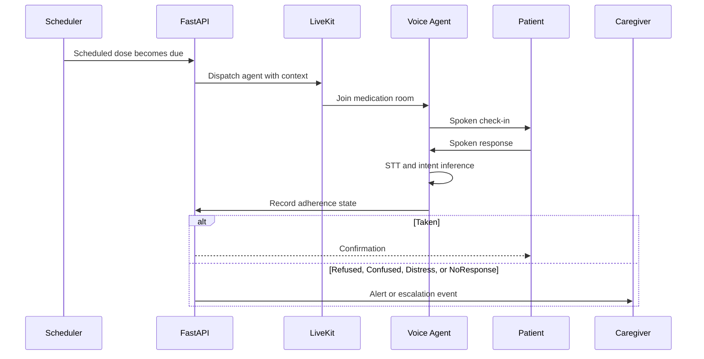

# DoseLuma architecture

## Design goals

DoseLuma separates privacy-sensitive edge processing from stateful backend and model-provider concerns:

1. Keep medication images and first-pass OCR on the iPhone.
2. Make the voice pipeline replaceable at the STT, LLM, and TTS boundaries.
3. Preserve a deterministic fallback when model inference is unavailable.
4. Persist safety-relevant state so process restarts do not reset cooldowns or adherence history.
5. Expose health and timing signals that can be monitored in deployment.

## Components

### Apple clients

- **iOS:** SwiftUI application for onboarding, schedules, medication scanning, adherence history, caregiver views, and voice sessions.
- **watchOS:** low-friction dose confirmation and vitals collection through the paired iPhone.
- **macOS:** local coordinator interface for a home-care deployment.

Apple Vision and VisionKit perform text recognition and barcode extraction on-device. HealthKit access is permission-gated by iOS. The current pill-analysis path uses explainable shape and colour heuristics rather than claiming a trained image classifier.

### FastAPI service

The Python service provides:

- medication schedule and adherence APIs;
- mobile snapshot synchronization;
- LiveKit token issuance and agent dispatch;
- real-time state updates over WebSocket;
- intent classification with model fallback;
- caregiver alerts and escalation hooks;
- health and scheduler-event endpoints.

SQLite stores local application state. Tests patch the database path to temporary files so regression runs do not modify developer data.

### Voice-agent pipeline

The LiveKit worker composes:

```text
audio -> VAD -> STT -> LLM/tool call -> TTS -> audio
```

Provider factories read non-secret routing from `config.json`; credentials are injected through environment variables. Pipeline callbacks record end-of-utterance, STT, LLM time-to-first-token, TTS time-to-first-byte, and approximate end-to-end latency.

### Deployment topology

Docker Compose starts:

- LiveKit for WebRTC signaling and media;
- FastAPI for application state and model-backed APIs;
- the voice-agent worker;
- an optional local OpenAI-compatible speech service.

The default configuration can use cloud inference. The speech container is available under the `local-speech` profile for offline experimentation.

## Medication check-in sequence



## Failure handling

| Failure | Current behaviour |
| --- | --- |
| LLM endpoint unavailable or invalid output | Fall back to deterministic lexical inference |
| Repeat agent dispatch | SQLite-backed room cooldown suppresses duplicate joins |
| Duplicate dose confirmation | Guard and escalate a possible duplicate-dose event |
| Patient silence | Watchdog retries with alternate phrasing, then records `NoResponse` |
| Optional SMS/voice credentials absent | Safe no-op while in-app and webhook paths remain available |
| Backend restart | Schedules and dispatch timestamps are reconstructed from persisted state |

## Security and privacy boundaries

- Secrets are read from `.env` and are excluded from Git.
- `config.json` contains provider routing and model IDs only.
- Medication images are processed on-device in the current implementation.
- Development credentials in Docker Compose are local-only and must be replaced for any shared deployment.
- The prototype does not provide diagnosis, dosage advice, or emergency services.

## Production gaps

The current project is a portfolio prototype, not a regulated deployment. A production path would require authenticated identities, TLS, encrypted storage, consent and retention controls, audit review, clinical validation, threat modelling, infrastructure-as-code, and service/model observability.
